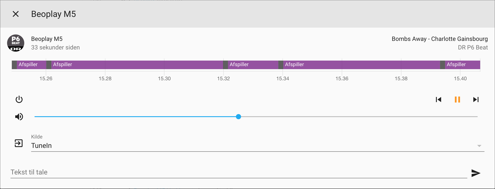

# Home Assistant Custom Component: Beoplay

This is an **experimental** custom component for [Home Assistant](https://www.home-assistant.io) which is an open source home automation system.


## Installation

1. Follow the instructions on [how to setup a development environment for Home Assistant](https://developers.home-assistant.io/docs/en/development_index.html)

2. Start the development environment (as described in step 1) to let it create default configuration files and folders, then kill it again (ctrl-c)

3. Drop the files from this repository into the newly created configuration folder

	```
	git clone git@github.com:martonborzak/beoplay-custom-component.git
	mv beoplay-custom-component/custom_components ~/.homeassistant/
	```

4. Add a configuration section to ~/.homeassistant/configuration.yaml and adjust the ip address accordingly:

	```
	media_player:
	  - platform: beoplay
	    host: 192.168.1.20
	    name: Beoplay M5
	```

5. Start the development environment (as described in step 1)

6. Check the log output to locate the endpoint, e.g. http://localhost:8123 and open it in a browser

6. Now go trough a number of hoops and loops in the UI to setup the device (TODO)

7. Eventually, perhaps, you will be able to control the volume of the device and see what it is playing :-)


## Example

This screenshot was taken while accessing a beoplay device from the Home Assistant "Log book" section.

